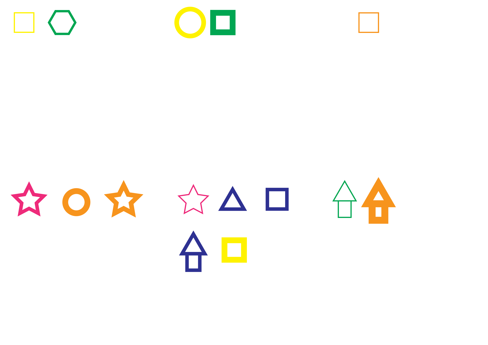
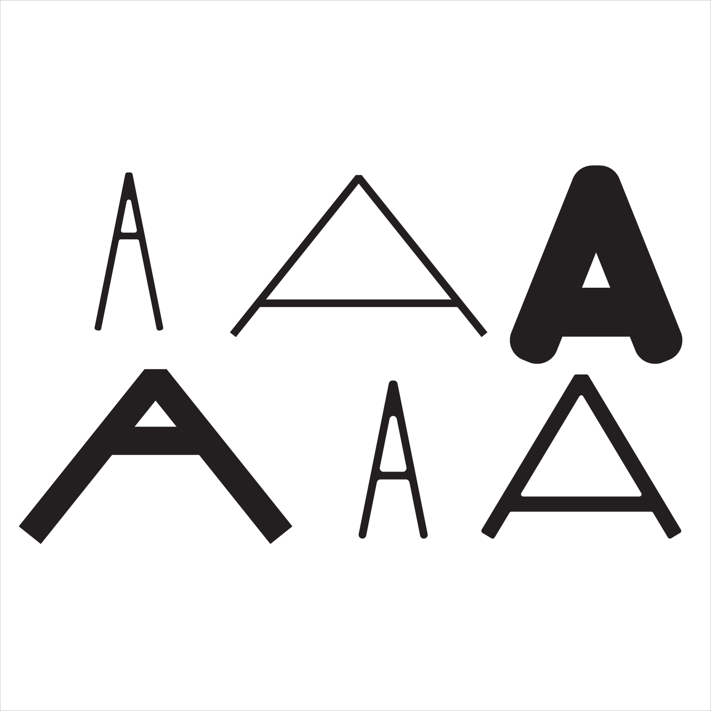

# WEEK_01
## Thoughts & inspirations 

I've started looking at Processing, trying to get an understanding of the what and how. I've looked a bunch of designers which use code and parametric/generative ideas in their work. One of the most interesting is 'Conway's Game of Life'. I love now something that has such simple starting parametres can be used to create things with such complexity.  

  
*image sourced from wikipedia.*  
https://en.wikipedia.org/wiki/Conway%27s_Game_of_Life  

## Personal trials

I know it ain't much but it's honest work; I played around with processing and made a little abstract artwork. It's made me realise how underneath all the design software we use, there is code (obviously) it's just something I don't pay much attention to.  

  

## Class Activity

This class activity was a good excerise to get us to undertstand the basic concept behind parametric design. The scale and complexity of these works could be so much larger if using a few lines of code. The element of randomness in this got me thinking about 'visual noise'. You could map a 50/50 black or white thing to each pixle on a window, and have it change every x amount of seconds.......

   

Since I'm very interested in type design and typography I made a type version of the class activity. The parametres I used were: width, crossbar height, roundness, and stroke weight. This is obviously a super rudimentary example but a good place to start. I may try to develop this further but I'm still at square one.

 
