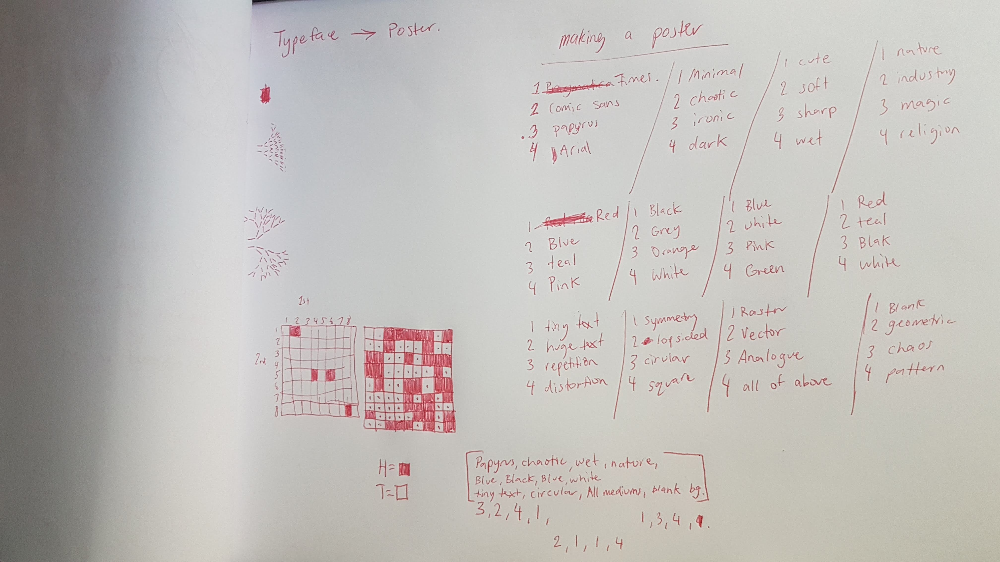

# WEEK_02

## Thoughts and inspirations

This week has been a little slower than expected. I haven't researched many generative designers, howerver I have been thinking about typography and how to link forms of data to a letterform. Responsive to the world around it. Which factors could I use, which factors would make the most sense for type? I'm sure there is a way to introduce variables into a font program. I'll have to find some programs first.... One of many possible ideas is that I could make a poster which responds in some way; perhaps what the webcam sees eg. movements, light + dark, sound. This makes me think of that type of art where images are made from tiny letters and glyphs.

## Class Activity

Here are some Processing experiments, one which I found quite visually striking (the pink face is a remix of Louis' work). I've been watching a bunch of 'The Coding Train' to gain more insight; there's so much to learn!

       

       

       

       

## 12 hour challenge

Because I'm quite stubborn I think I can say with some certaintly that the final outcome for this studio will be revolving around typography in some way. For the first 12 hour challenge I wanted to have a creative outcome, I chose to make a poster with a variety of parameters — ones which I might normally stray away from - like a typeface such as Comic Sans. Perhaps it's time we reclaimed this font and changed it's identity. I think the final outcome is great because it's so unusual. It's interesting that despite all of the parameters chosen by chance, they are still filtered through my mind, and I interpret them in my own way. A computer would be much more rigid with it's outcomes, and so I would love to find a way of coding similar parameters to see how that turns out.

  

    
