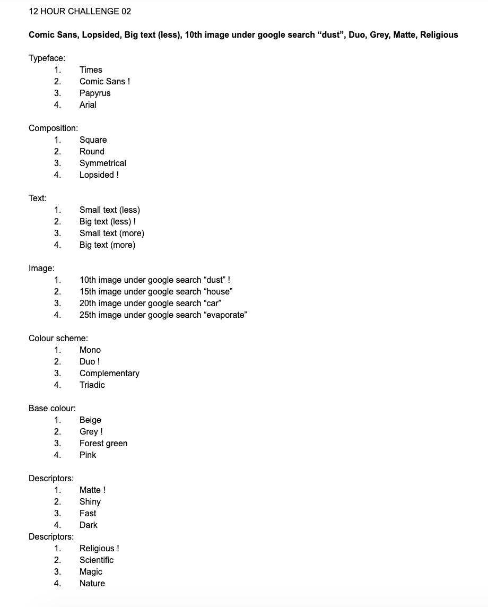

# WEEK 03

## Processing experiments
Some experiments using floats and the random function. Here I've let a bunch of low alpha ellipses build up over time to create this RGB gradient. The idea behind this was to create a randomised pattern which could then be examined for shapes that look like letter forms. Perhaps feed this image back into the system and have it examined by computer vision, then project the found letters onto a poster. Something which is very much still out of my reach.

  

  

  

Here I stretched the ellipses which did away with the gradient and instead made it look more like the back of some embroidered fabric. I think the idea of digital fabric. Perhaps something to look into.

## 12 hour challenge
I decided to continue the poster challenge from last week as I think the continuity will give the results a level of comparability at the end of semester. I created much more streamlined parameteres for week03. I introduced a google image search parameter into the mix. 

 

I quite like the idea of using Comic Sans. I recently found out that it was considered the number 1 typeface for legibility for people with dyslexia. 
