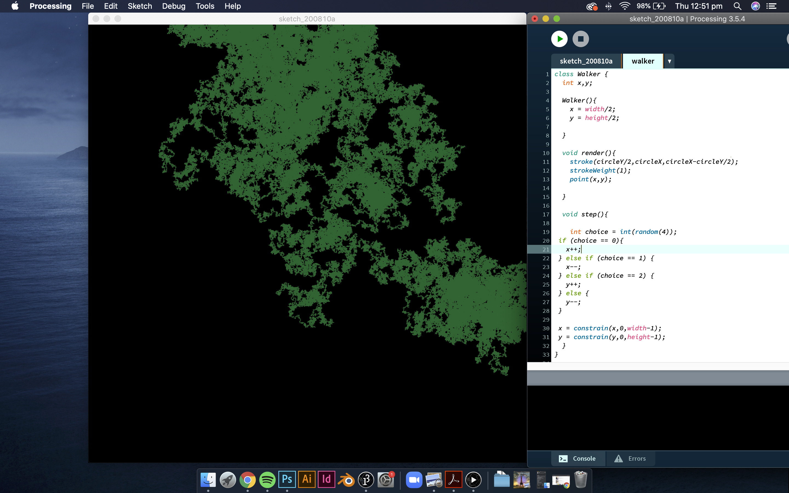
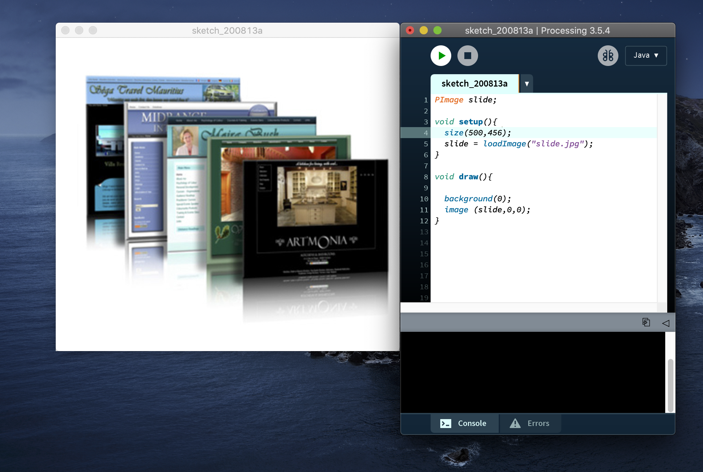
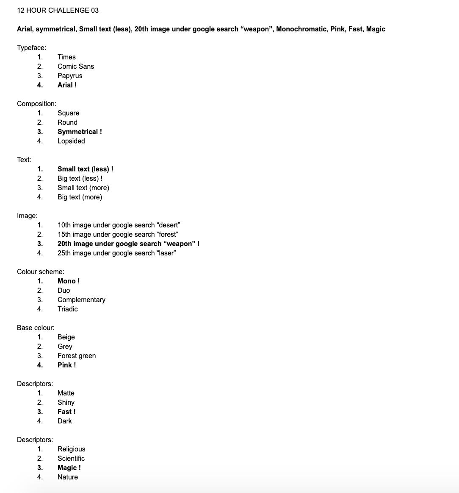
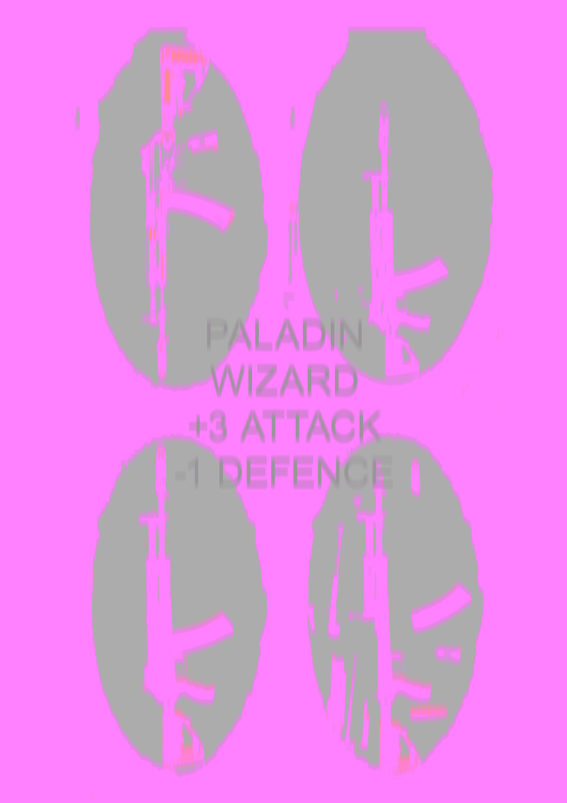

# WEEK 04

## Research & Brain storming
I've begun thinking about which concepts I could potentially explore for my proposal. Currently there are a handful of ideas which have potential:

 

— Type that reacts to movement, via a webcam or something similar

— A poster generator, something that you can feed things into and it will turn it into a poster, this would have changeable parameters (maybe computer vision?)

— Type that is responsive to ANY input that relates to some kind of yet undetermined theme

— A colour interpreter (something that has a webcam input, and mixes up the colours and values and then re-applies them to any given shape eg. a vector or something

— 3D scanning objects and using those in some generative way

— DE-generative design, making an algorithm that mimics decay and wear. Can be used on 3D models and scans of artefacts

— An automated tapestry weaver/decayer. Randomness but within certain parameters so that it creates some random elements but some that are a little more organised

 

I've done some research into variable typeface design and I'm very interested in it, but I'm leaning towards the idea of the automated tapestry weaver. I think the act of weaving is an ancient and distinctly human activity; making a machine weave something raises many interesting questions. Through my research I have come across the work of [Phillip Stearns](https://phillipstearns.wordpress.com/fragmented-memory/). He's an artist who has completed a series of large scale woven tapestries using visualised binary data sourced from his hard drives. This work is a different take to what I have planned, since the tapestry would consist of things that are procedurally generated, and they would be digitally woven.

His work explores the concept of physical memory and how *"The assemblage of data in a computer’s physical memory serves as a record of human activity and agency, however abstracted and fragmented. By analyzing and understanding the data in a computer’s physical memory, it is possible, in some respects, to reconstruct a profile of the individual operating the machine".* 

## Processing experiments
There are multiple steps which will go into making this digital tapestry a reality. I've started watching specific tutorials for things which I think may help me achieve this. 

Here I learned how to load images into your sketch

These were some interesting experiments. I was also able to create a pulsing/flashing rainbow version of the loaded image...might come in handy

## 12 hour challenge 
Another iteration of the same 'poster by chance' system.

