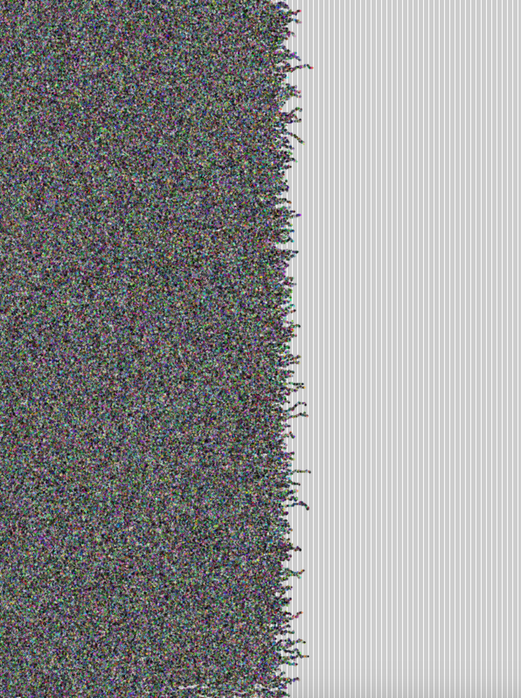

# WEEK 06
## Processing Class activity
I slighty tweaked the code for the sound activity we did in class. You can see it at this [link](https://www.youtube.com/watch?v=VPaWqQy2fak&feature=youtu.be&ab_channel=samosquito1) It's safe to say that fill(random(255), random(255), random(255)); is be best friend at the moment.

## Tapestry progress
I've made some progress on the self weaving tapestry. Using an array of random walkers, i've managed to create a very simple weaving animation. So far it doesn't stop when it reaches the edges, and it also doesn't weave one thread at a time. Currently the hue of each drawn point is set to random but I would like for it to access a limited palette; perhaps colours taken from images sourced from the web.

After some peer discussions it was suggested that maybe I could have the tapestry weave itself LIVE online...not sure how I would do this but it think it works really well for the themes of my work. Weaving is a really slow, time consuming thing; allowing people to experience this process real time might make for an interesting experience. I could maybe use the speed of a computers processing power to make a statement about technology but honesty I hate that kind of profound stuff. Rather, I would want the substance of the experience to be the visuals.

It's now a matter of implementing more features, hopefully I can add a new one by the next 2 weeks.

  
