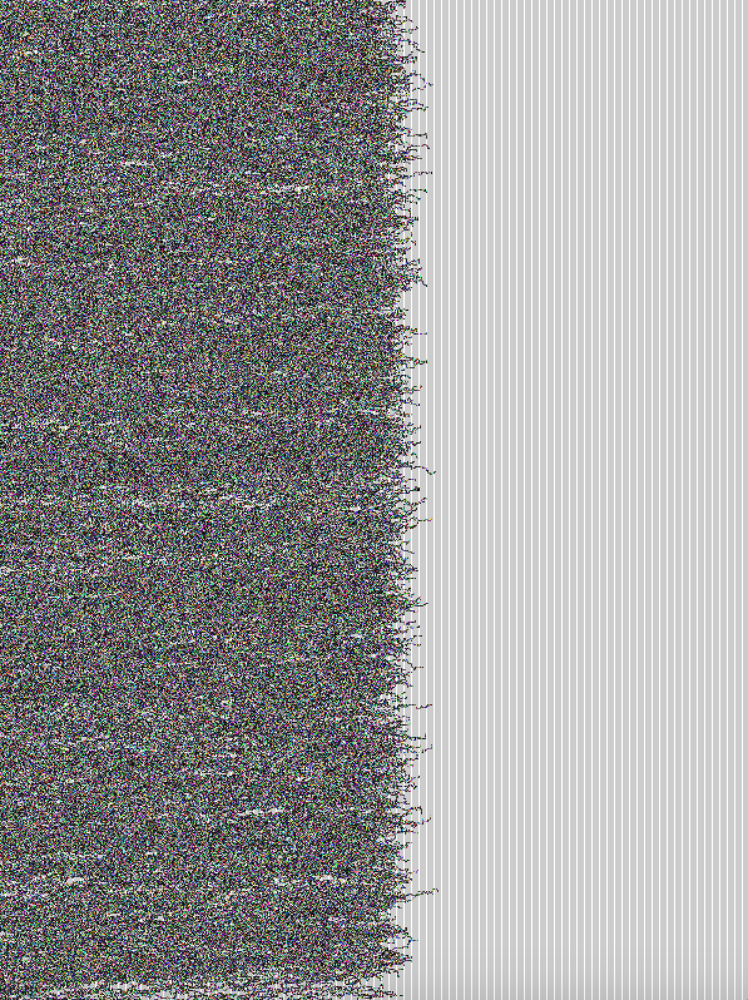

# WEEK 06
## Processing Class activity

## Tapestry progress
I've made some progress on the self weaving tapestry. Using an array of random walkers, i've managed to create a very simple weaving animation. So far it doesn't stop when it reaches the edges, and it also doesn't weave one thread at a time. Currently the hue of each drawn point is set to random but I would like for it to access a limited palette; perhaps colours taken from images sourced from the web.

After some peer discussions it was suggested that maybe I could have the tapestry weave itself LIVE online...not sure how I would do this but it think it works really well for the themes of my work. Weaving is a really slow, time consuming thing; allowing people to experience this process real time might make for an interesting experience. 

  
