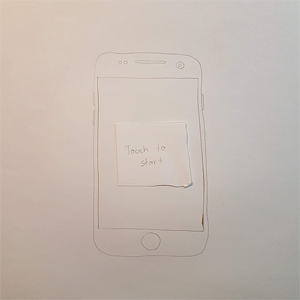
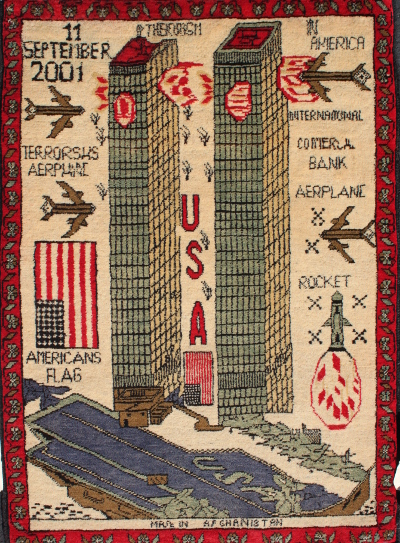
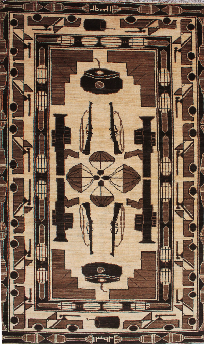
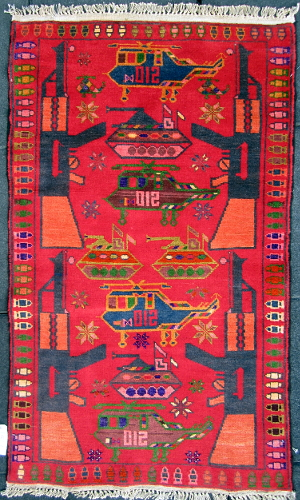

# WEEK 07

## PSEUDO CODE for project
Var INPUT API (google image search “#####”);  
(Takes images from web and stores them somewhere to be accessed later);  
  
Function setup(){  
CreateCanvas (windowWidth, windowHeight);  
Initialize (warp lines, weave + decay speed);  
Function random walker();  
}  
  
Function screenPressed(){  
Display blank screen (“Touch here to begin”);  
oncePressed (Random walker (only moves right));  
IF starts weaving, stoke uses API sourced image (new random image per page load);  
ELSE IF (thread reaches edge, stop weaving);  
ELSE IF (60seconds passes, new ‘decay’ random walk starts);  
END IF (screen is covered in decay);  
}  
  
## Paper prototype 😻
Here is an extremely simple paper version of what my project may look like. All the parameters like weave time and decay rate are still up in the air and they will be tweaked according to my yet to be decided final concept. I want to focus on making it work on phones, as the dimensions for a lot of rugs are similar to that of smart phone screens. Currently I am researching API's and whether or not this is a possible solution for image sourcing. An alternative I'm thinking about is making a series of 4-6 parametric rugs using analogue methods, then having my algorithm select a rug at random on page load. This would re-link the tactile and analogue aspects of tapestry and rug making to my project. I'm finding that the current concept for my project is quite fluid.

 

## PSEUDO CODE for daily task
INPUT(){ thirst;  
IF (parched; chug +1);  
ELSE IF (a bit thirsty; sip + 1);  
ELSE IF (quenched; burp);  
END IF (moisturised, in your lane, unbothered);  
OUTPUT() pee;  
}  

## Rug inspiration
Through my research I've come across a range of 'Afghanistan war rugs' which depict imagery from the soviet invasion in the 1980's, weaponry, as well as depictions of 9/11. This is interesting to me because it made me think of the purpose of these rugs, and ultimately the purpose of art in any form —atleast in a traditional sense; to depict things of significance. The fact that a culture with a deep history of weaving has used traditional means of image making to translate the happenings of the current time, highlights the significance of the medium itself. These rugs all use patterns and shapes which speak of their historical origins, yet the imagery is entirely modern. I am thinking of ways in which I can tap into this concept and perhaps use it for my digital rugs.   

  
  
  

