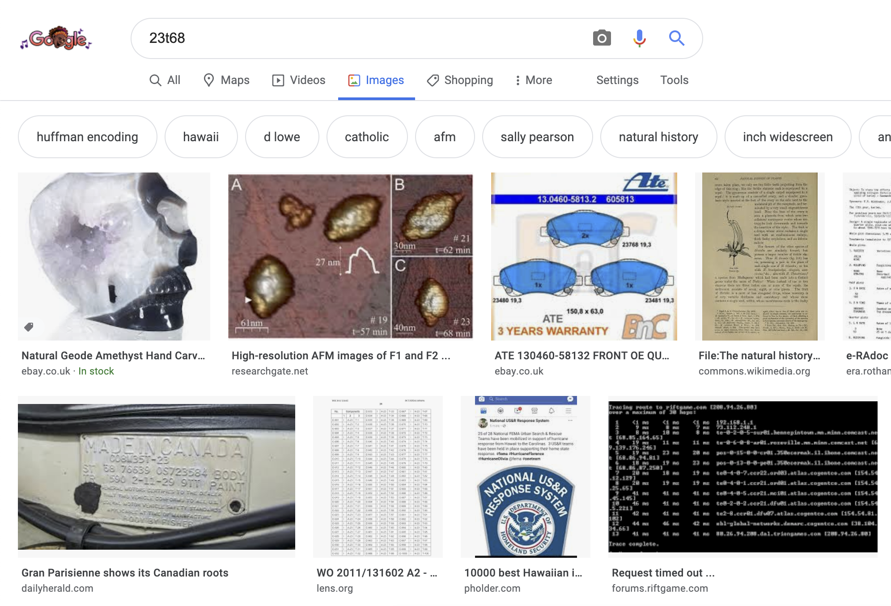
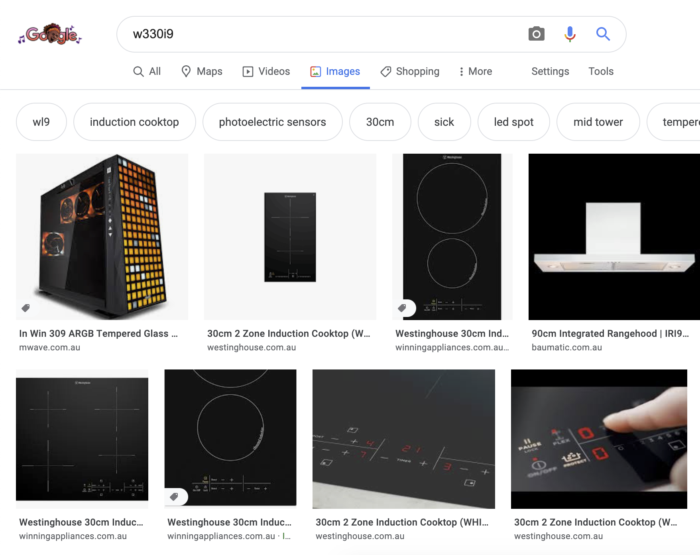
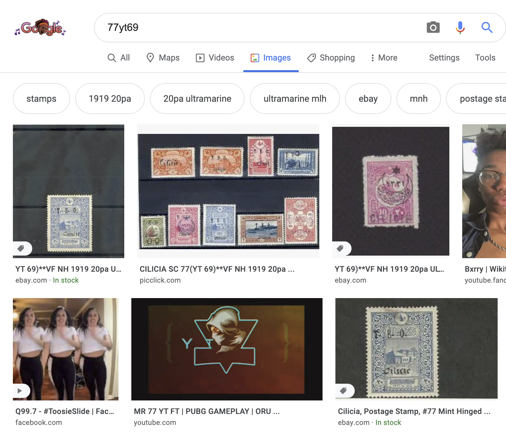

# WEEK 08

## Project development: 'Images of insignificance'
I've been researching API's including Google search api, Flickr, Instagram etc. The initial idea was that I had was to have a random image scraped from one of these services which is then woven into my tapestry. I feel that with this concept there is a disconnect  Instead I will try to incorperate more analogue parametrics.  

I stubbled upon this technique by chance many years ago; typing random numbers and letters into Google image search gives you some very strange results — images without any context. This style of searching could be seen as an obscure form of digital archeology, unearthing and rediscovereing old images. To me these pictures lack significance, yet the fact that they are 'digital artefacts' means they do in a way bare some significance. In many ways real life artefacts are just everyday objects.... Here are some examples:

  
  
  

The plan is to set a 4-6 character google search parameter (e.g.  _ _ _ _ _ heads or tails will determine if the character will be a letter or a number, then depending on the outcome I will use 10 or 26 sided dice). Once this 5 character word has been generated I will use it in a google search and manually scrape 'images of insignificance'. Then once I've sourced these images I will use the same method with which I made the '12 hour challenge' posters. The main difference being that they will be made in a symmetrical way to mimic the visuals of existing rugs and tapestries. I know this all sounds quite rambly but it will make sense....i hope.
