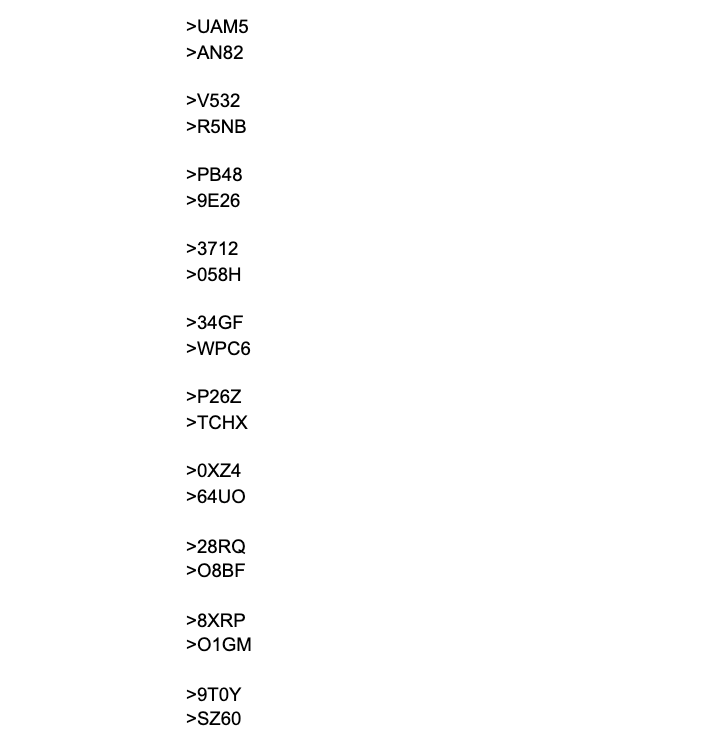
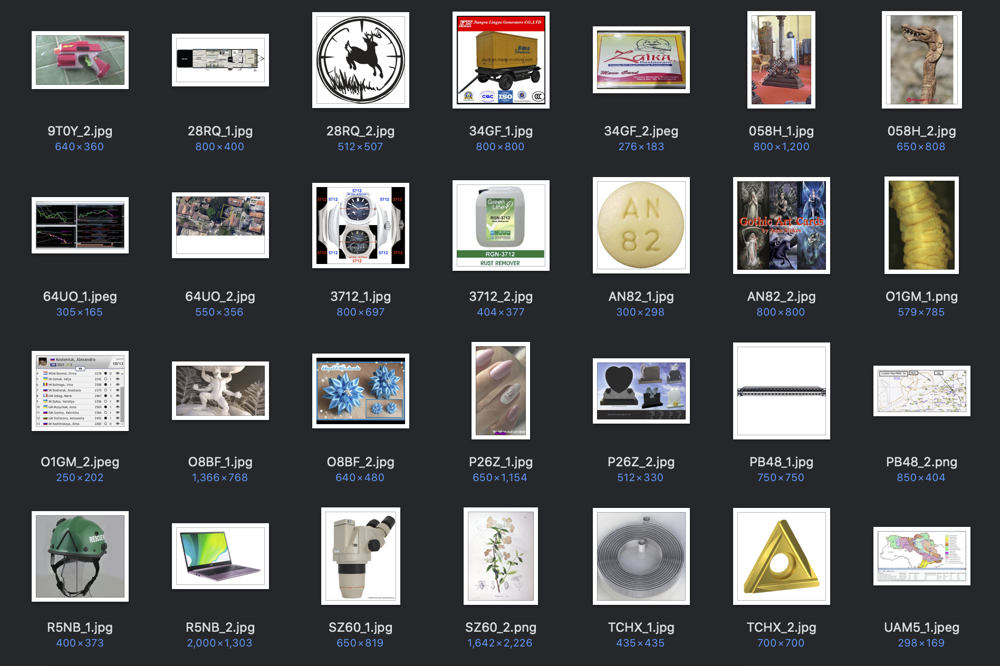
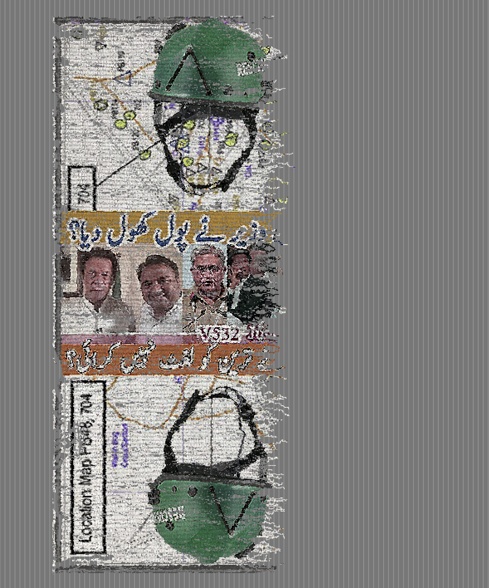
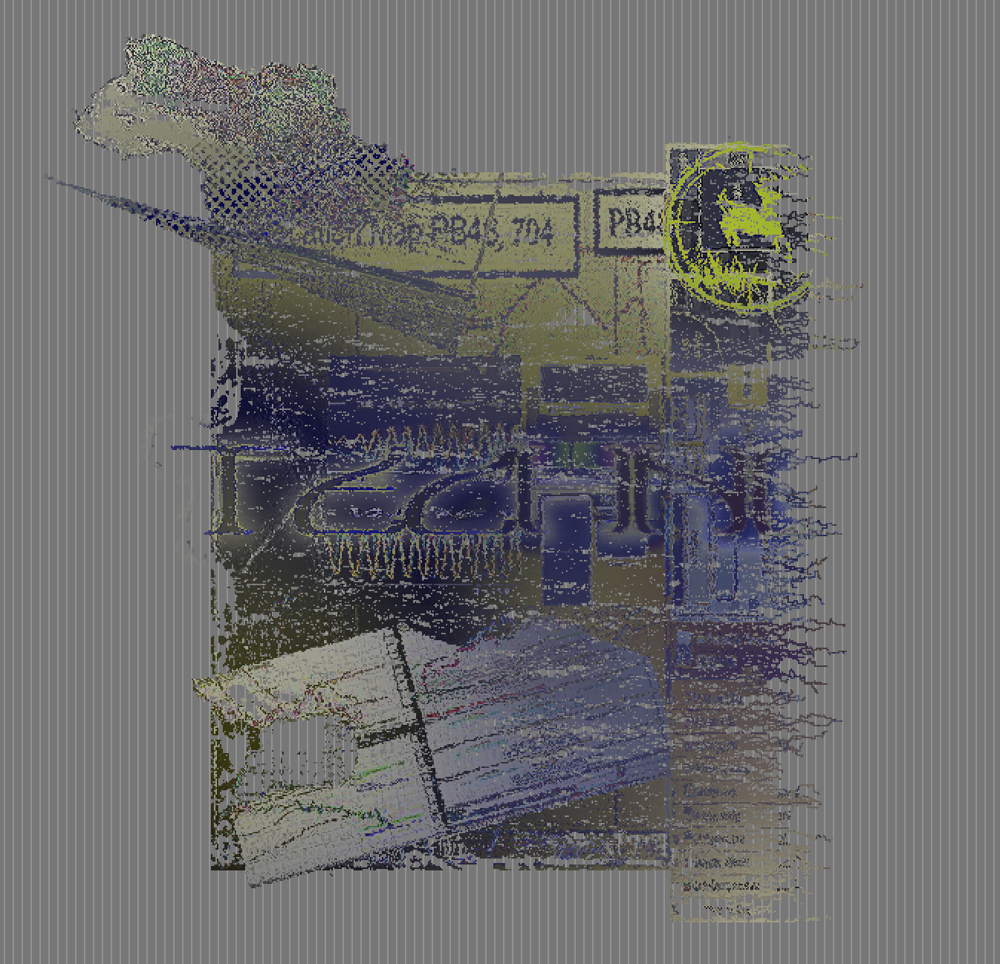
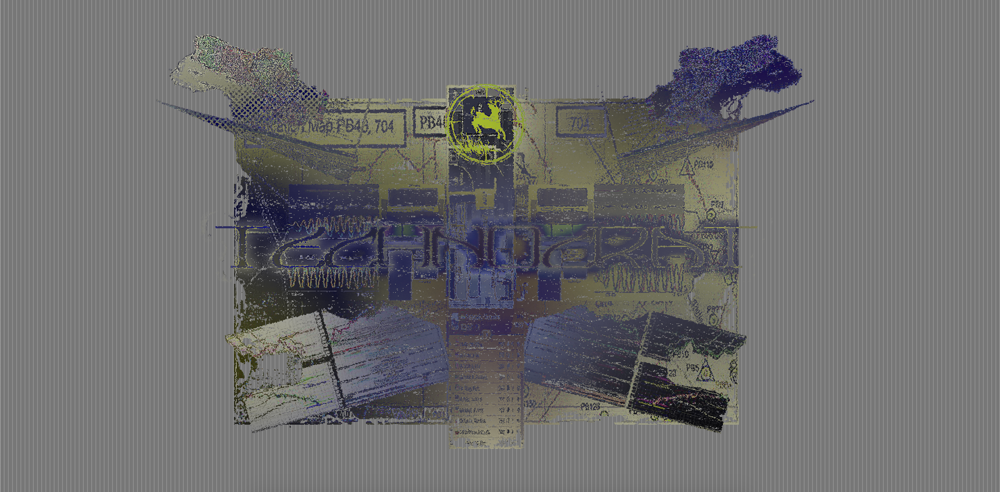

# WEEK 09

## Project progress
To begin the image making process I flipped a coin 80 times to determin if each character would be a number or a letter, then I used a 'random letter generator' app, and a ten sided die. These were the codes I came up with; which I then used to manually scrape images from Google Images.   
  
   
These are just some images I sourced. I think many of the search results are strange electircal components, machine parts, and funnily enough wrist watches... This must be due to the search parameters being similar to some kind of product code. There are however a lot of other weird results. In some case I chose the weirdest ones I could find, and in other instances I deliberately chose images which would be used together. It is a really fascinating exercise looking at all of these images and trying to imagine what their purpose was. It's bitter sweet because you realise how insignificant everything is; yet amazing how each one is a tiny snapshot into a strangers life.   
  
   
## Rug design evolution
Here I've started experimenting with different rug designs. At this stage I was still quite attached to the idea of a rug being a rectangle. I think seeing as this project is largely about looking at rugs in a modern context, and if I'm already questioning what kind of imagery appears on them, why should I not also question their shape. Traditionally speaking rugs were this shape as this shape provided strength and structure.   
  
   
   
   
This example is a work in progress using the 'Coldera' typeface by Ollie Schwan. I want these tapestries to work as potential wall hangings; more artworks than floor coverings. Generally speaking floor covering rugs and tapestries are quite heavily focused on repitition and dense pattern. In many ways I'm treating these tapestries almost as woven posters; I want to continue using typography.    

Another aspect of these designs are that they have decay on them from the very beginning. This is mainly due to time limitations etc. 
