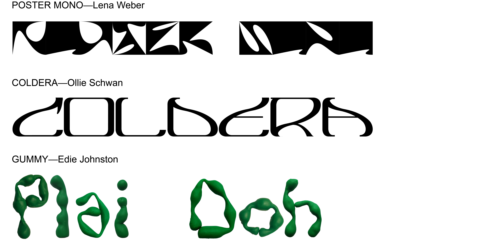
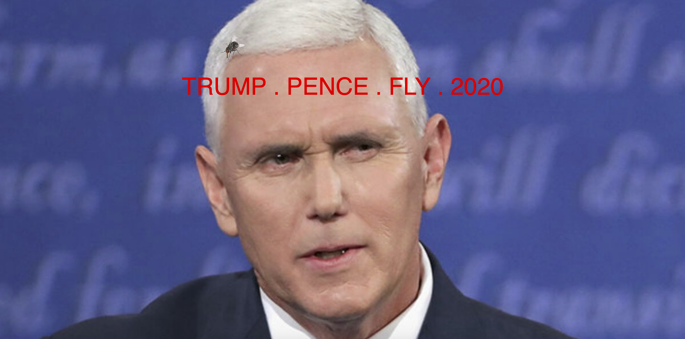

# WEEK 11
## Type Incorperation
I've reached out to a number of young designers to incorperate some new and unisual typefaces. I think that this would further bring the imagery on the tapestries into a contemporary context.   
  
  
  
  
  
## Tapestry Development
I've continued creating these tapestries. It feels like I'm making collages sometimes with these images. 
rug3   
  
rug4   
  
## TRUMP . PENCE . FLY . 2020
Check out what I made: https://samkoesterke.github.io/p5-test-environment/TRUMP_PENCE_FLY_2020/
  
