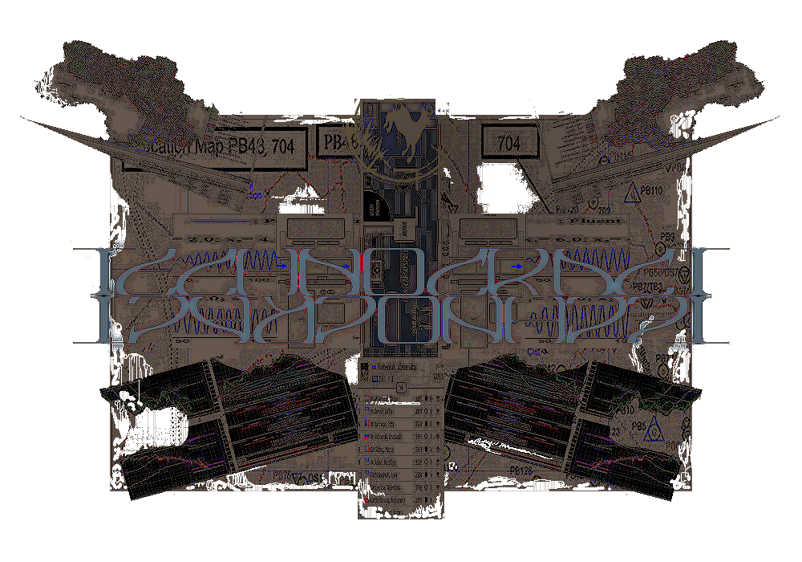
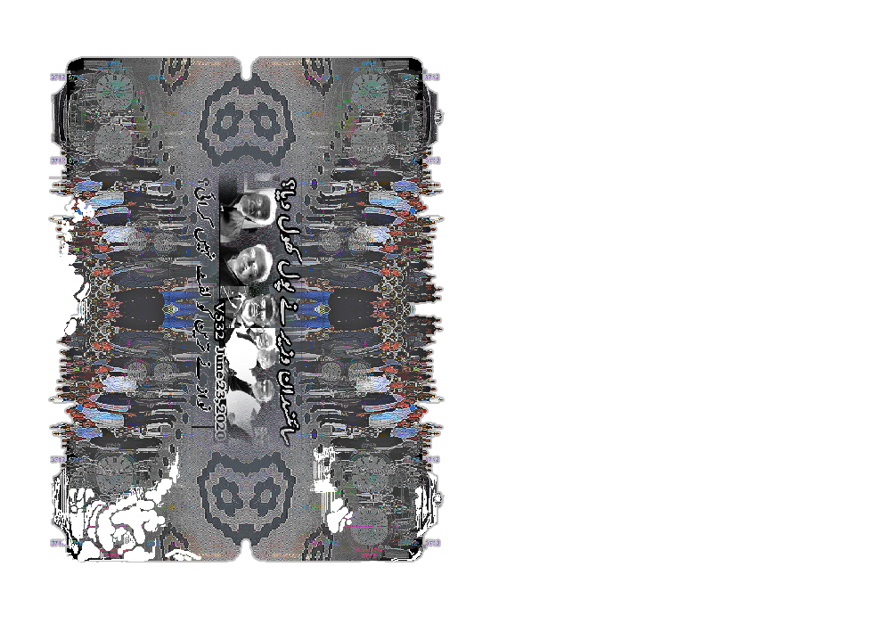
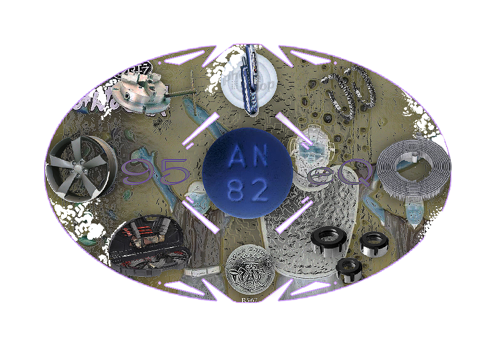

# WEEK 10
## Project progress
This is the fun part for me. I want to look at rugs in a contemporary and simultaneously digial context. I'm focusing on symmetry and asymmetry, the shape of the rug, as well as the decay. I've taken some creative liberty and have taken inspiration from embroidery techniques; where layers of thread are used to create a slighty embossing effect, especially around the borders of shapes. As for the decay, the aim is to have it occur in certain areas as if there is an underlying structure or thinner and thicker areas of fabric. Places that are less likely to be affected by decay are borders and the edges of shapes.   
   
As we know, art and design is influenced heavily by the tools used to create it, they impose limitations on what is creatively and visually possible; as well as this a work will inadvertently reflect and communicate about the time period it was created in. I think there is an interesting interaction between the algorithm used to weave the rugs, as well as the algorith behind all of the insignificant images I have sourced. It feels like this chaotic and nefarious force over which we have no control — a being which holds a mirror up to ourselves. 
rug0   
  
rug1   
  
rug2   
  
rug3   
  
