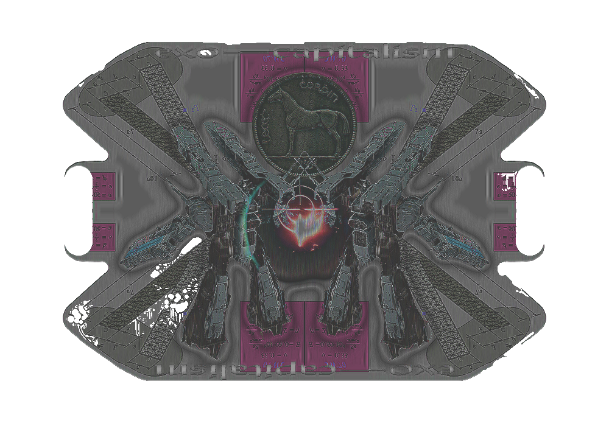

# WEEK 10
## Project progress

This is the fun part for me. Currently I'm just experimenting on photoshop to come up with contemporary rug designs. I'm focusing on symmetry and asymmetry, the shape of the rug, as well as the decay. For the decay, the aim is to have it occur in certain areas; as if there is an underlying structure. Places that are less likely to be less affected by decay are borders and the edges of shapes.  
  
  
  
  
