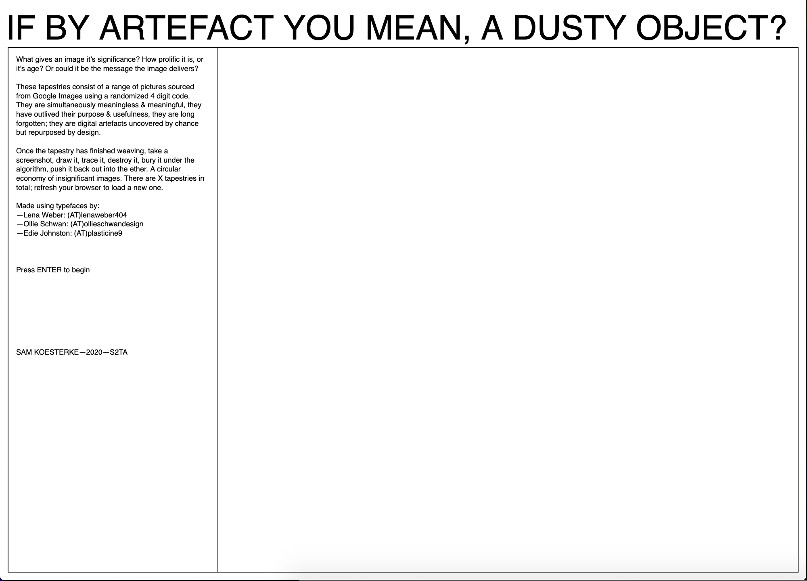

# WEEK 12
## Project finalizations
I've been taking steps to finalize the project, making sure it has a relative level of polish. I've introduce a new typeface called 'Hagrid' by ZetaFont. I've also adjusted the text so that it scales to browser windows of different sizes. I've also applied this modifications to the weaving of the tapestries however I haven't been able to make it mobile friendly. 

 
 
 
