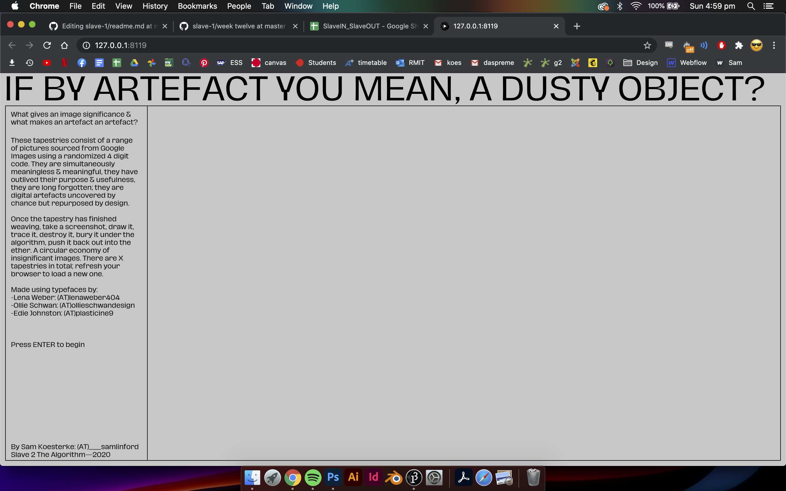

# WEEK 12
## Project finalizations & polish
I've been taking steps to finalize the project, making sure it has a relative level of polish. I've introduce a new typeface called 'Hagrid' by ZetaFont. I've also adjusted the text so that it scales to browser windows of different sizes. I've also applied this modifications to the weaving of the tapestries however I haven't been able to make it mobile friendly. Andy's advice was that the tapestries were not given centre stage, and that it felt a bit too much like a demo. I've made changes to the intro text which allows for full focus to be on the tapestries. 
 
 
 

## Final tapestry design
This is the final tapestry design I've decided to make for this project. It uses the least number of sourced images but instead focuses on the Gummy typeface by Edie Johnston (a fellow student). 
 
rug5
 
